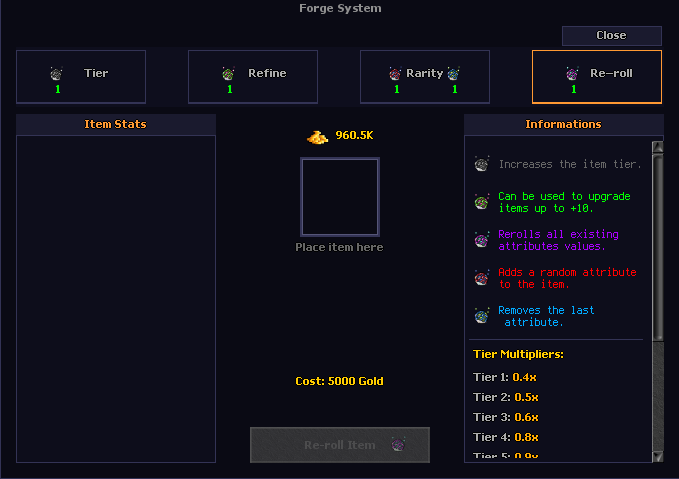

# Forge System

Equipment rarity progresses from Common to Mythic. Use the forge interface at anvils; the casino includes a +1 anvil and can be reached from the city temple teleport.

## Rarity and tiers

- Special Orb upgrades an item's rarity.

- Cleanse Orb safely downgrades rarity.

- Ascension Orb raises an item's tier at an anvil.
- Monster drops normally reach Tier 4; use Ascension for higher tiers. Mythic rarity requires Tier 6.

| Tier | Multiplier |
| --- | ---: |
| Tier 1 | x0.4 |
| Tier 2 | x0.5 |
| Tier 3 | x0.6 |
| Tier 4 | x0.75 |
| Tier 5 | x0.9 |
| Tier 6 | x1.2 |

## Refinement and attributes

Refinement boosts an item's raw Attack and Defense to +10. A successful Refinement Crystal attempt raises the item level by 1 and Item Power by 5; a failure lowers the level by 1. Success starts at 100% from +0 to +1 and falls by 10% per level, reaching 10% from +9 to +10.

Highroller Orb can be used on rarity greater than 1. It keeps attribute types such as Attack and Crit, while randomizing their numeric values.
