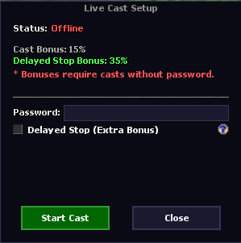
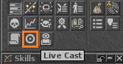

# 📺 Live Cast System

The Live Cast system allows players to broadcast their gameplay while offering significant experience (EXP) bonuses as an incentive for keeping streams public.


**Earn Up to +15% EXP Boost:**
- **Public Cast Bonus:** +10% EXP boost
- **Delayed Stop Bonus (5 min):** +5% extra EXP boost
- **Total Max Bonus:** **+15% EXP**


## 🖥️ In-game Menu

Look for the Live Cast icon in your game interface to start broadcasting!

## ⚙️ Core Mechanics

- **Public Cast Bonus:** Initiating a live cast without setting a password automatically grants a baseline **10% experience boost**.
- **Delayed Stop Feature:** Checking the **"Delayed Stop (Extra Bonus)"** option modifies how the broadcast ends. Instead of turning off instantly, the cast remains active for an additional **5 minutes** after the player decides to stop it.
- **Maximum Reward:** Accepting the 5-minute delay rewards the player with an extra **5% experience**. When combined with the public cast bonus, players can earn a **15% total EXP boost**.


**Restrictions:** Setting a password makes the broadcast private and **completely disables** both the 10% and 5% bonus modifiers.


