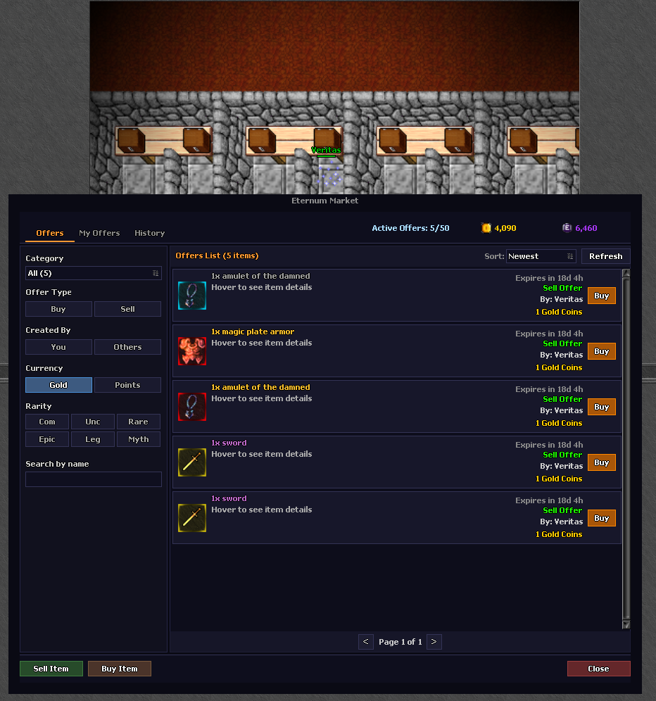

# Market System

Buy and sell items with ease using the in-game Market.

## Trading Made Simple

The **Market System** allows players to create offers to buy or sell items directly within the client.

- **Create Offers:** Set your price and quantity for buying or selling.
- **Advanced Item Handling:** Fully supports items with **Rarity**, and other custom attributes.
- **Supply & Demand:** Check current listings to gauge the market value of your loot.
