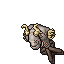
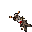

# 🎯 Strefa Bezpiecznego Treningu

Ten system dotyczy w szczególności Strefy Treningowej Monk (Monk Training Area). Został zaprojektowany, aby zachęcać do **tradycyjnego treningu** oraz **tworzenia run** (runemaking).


Dostęp do Strefy Treningowej uzyskasz przez teleport znajdujący się wewnątrz **Świątyni** (Temple) każdego miasta. Potrzebujesz co najmniej **1 minuty** staminy, aby wejść.


## ⚙️ Mechanika Strefy Treningowej

- **Pojemność:** Każdy gracz rozpoczyna z **6 godzinami** podstawowej staminy, którą można rozbudować do **12 godzin**.
- **Lokalizacja:** Dostęp do Strefy Treningowej uzyskasz przez teleport znajdujący się wewnątrz **Świątyni** każdego miasta.
- **Wymagania:** Potrzebujesz co najmniej **1 minuty** staminy, aby wejść w teleport.
- **Zużycie:** Stamina spada tylko wtedy, gdy przebywasz wewnątrz **Strefy Treningowej**.
- **Wyczerpanie:** Gdy osiągnie 0, zostaniesz wyrzucony z sali treningowej i musisz poczekać na jej regenerację.
- **Regeneracja:** Stamina regeneruje się automatycznie, gdy jesteś **poza** strefą treningową (podczas polowania, stojąc w DP, po wylogowaniu).


**Kary w Strefie Treningowej:**
Wewnątrz strefy treningowej **Skill rośnie o 50% wolniej**, a **Regeneracja Many jest zredukowana o 50%**.


## 🧪 Przedmioty do Staminy

- **Stamina Refill:** Regeneruje do **2 godzin** staminy. Może być używany stopniowo (np. zregenerowanie 30 minut pozostawia 1h 30m staminy w przedmiocie).
  
- **Stamina Extension:** Trwale zwiększa Twoją maksymalną staminę o **+1 godzinę**. Maksymalny limit: **12 godzin**.
  

## ⚔️ Broń Treningowa (Exercise Weapons)

Używaj Exercise Weapons na Kukłach Treningowych (Training Dummies), aby efektywnie trenować swoje umiejętności. (Miecz, Topór, Obuch, Dystans, Poziom Magii)

### 🎯 Kukły Treningowe (Training Dummies)

- **Standardowa Kukła (Standard Dummy):** Rozsiane po całej mapie.
  
- **Ekspercka Kukła (Expert Dummy):** Może być postawiona przez gracza w dowolnym miejscu (poza Strefą Ochronną / Protection Zone) za pomocą **Dummy Ticket**.
  - **+20% Bonusu Efektywności** w porównaniu do standardowych kukieł
  - *Obowiązują ograniczenia dotyczące miejsc stawiania (np. zakaz blokowania przejść).*
  
- **Dummy Ticket:** Użyj tego przedmiotu, aby zespawnować swoją osobistą kukłę.
  

## 🤖 Auto Trainer

Możesz aktywować **Auto Trainer** bezpośrednio z poziomu **Interfejsu Klienta**.

- **Anti-Idle:** Utrzymuje Twoją postać online.
- **Spell Caster:** Automatycznie rzuca czary, aby trenować Twój poziom magii.
- **Auto Food:** Automatycznie zjada jedzenie, aby regenerować manę/zdrowie.
