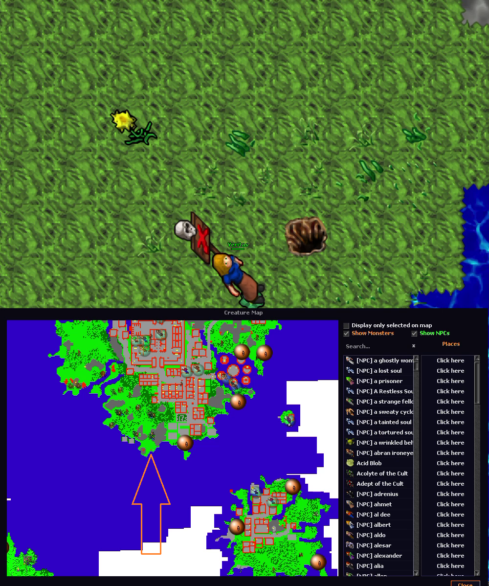
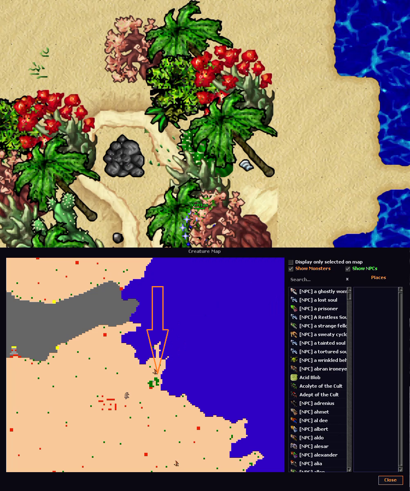
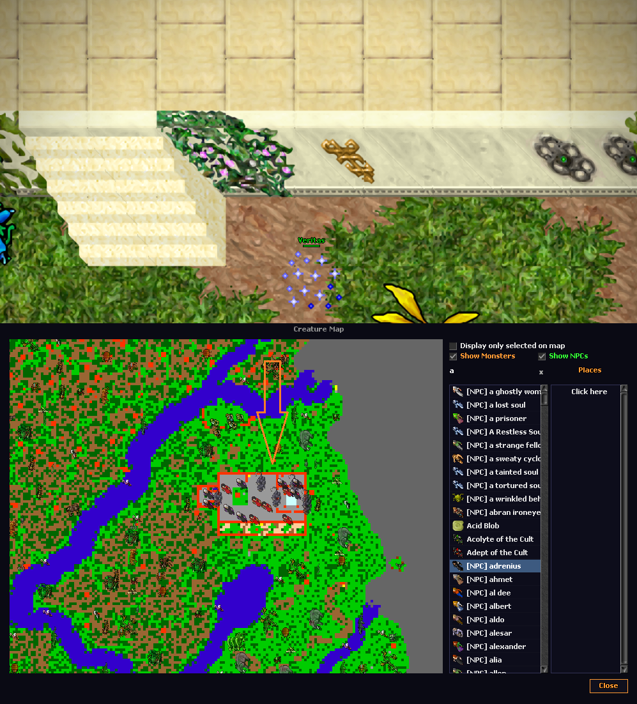

# Áreas Customizadas

## Cidades e quests

Conheça as cidades customizadas de Svargrond e Yalahar. As quests em destaque são Inquisition (sete bosses e Ultimate Blessing), Pits of Inferno com loot lendário, Svargrond Arena em três dificuldades, Demon Oak e Blue Legs Quest nas ruínas de Koshei com equipamentos raros.

## Hunts

Lizard Isle tem Drakens, High Lizards e Strong Lizards. Fale com o NPC para chegar à ilha escondida após entregar 50 Lizard Scales e 50 Lizard Leathers.

Outras hunts incluem Darashia North Dragons, Edron Heroes, Edron Vampires, Edron Werecreatures, Mother Scarab Lair, Port Hope Asuras, Port Hope Spider Cave, Thais South East Dragons, Wyrm Drefia e Venore Walls.

          
