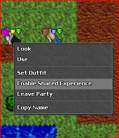

# Sistema de Experiência Compartilhada

Prepare-se para melhorar suas aventuras com os membros de sua party (grupo). Com a Experiência Compartilhada habilitada, os pontos de experiência são distribuídos entre todos os membros de sua party, tornando sua jornada ainda mais recompensadora.

Isso significa que você poderá subir de nível em um ritmo acelerado, forjando personagens mais fortes juntos! Para aproveitar ao máximo a Experiência Compartilhada, há algumas condições a se ter em mente.

- **Membro da Party:** Os jogadores devem entrar em uma party para acessar os benefícios da experiência compartilhada.
- **Proximidade de Nível:** Os membros da party devem ter um nível que seja de pelo menos 2/3 do nível do jogador, garantindo um alinhamento razoável de progressão dentro do grupo.
- **Participação Ativa:** Os jogadores devem se envolver ativamente no combate, curando ou atacando, para se qualificar para os pontos de experiência compartilhada.

Em primeiro lugar, certifique-se de que você está em uma party, colaborando com colegas aventureiros. Além disso, para que a experiência seja compartilhada, os membros de sua party devem ter um nível que seja pelo menos 2/3 do seu próprio nível. Esse requisito garante que os membros da party estejam razoavelmente alinhados em sua progressão, promovendo um crescimento equilibrado dentro do grupo.

Mas não é só isso — a participação ativa no combate é fundamental para colher os benefícios da Experiência Compartilhada. Envolva-se em batalhas ferozes, seja desferindo ataques devastadores ou fornecendo suporte de cura vital aos seus camaradas. Ao contribuir ativamente nas lutas, você garantirá uma distribuição justa dos pontos de experiência entre aqueles que participam ativamente das aventuras.

Abrace o poder da Experiência Compartilhada e embarque em uma jornada épica ao lado dos membros de sua party. Trabalhem juntos, conquistem desafios e vejam seus pontos de experiência dispararem. Suba de nível mais rápido, fortaleça seus laços e aproveite a jogabilidade cooperativa imersiva que espera por você. O mundo é seu para conquistar, então reúna sua party e deixe a aventura compartilhada começar!

## Informações de Bônus

O bônus de experiência depende do número de jogadores e se vocês possuem vocações únicas na party:

- **2 Jogadores:** 20% de experiência extra (se ambos tiverem vocações diferentes), ou 15% se forem iguais.
- **3 Jogadores:** 35% de experiência extra (se todos os 3 tiverem vocações diferentes), ou 20% se alguma se repetir.
- **4 ou mais Jogadores:** 65% de experiência extra (se todas as 4 vocações estiverem presentes), ou 35% se alguma se repetir.
