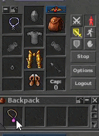

# 🛡️ Proteção de Item

Proteja seu equipamento e evite perdas ao morrer.


Usar um **Amulet of Loss (AoL)** ou um amuleto encantado com AoL protege você de perder sua mochila e equipamentos ao morrer.


## 📿 Amulet of Loss (AoL)

O **Amulet of Loss** é um item essencial para aventureiros.

- **Função:** Impede que você perca sua mochila e equipamento ao morrer.
- **Uso:** Deve ser usado no espaço do amuleto para funcionar.

## ✨ Encantando Amuletos

Você não precisa escolher entre proteção e atributos!

- **Encantamento:** Você pode usar um AoL para **encantar outros amuletos** (ex., Scarf, Platinum amulet e outros).
- **Efeito:** O efeito de proteção é transferido para o amuleto alvo.
- **Benefício:** Isso permite que você use amuletos poderosos e, ao mesmo tempo, fique protegido da perda de itens.
